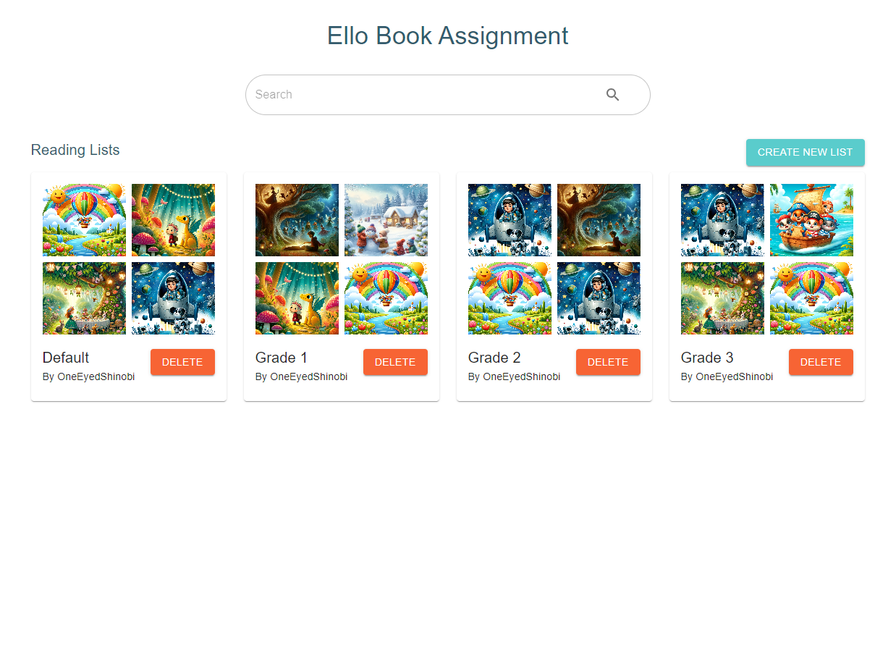

# Ello Book Assignment

## Introduction

Welcome to the Ello Book Assignment project! This project is a part of the Ello Engineering Challenge.

This project involves building a teacher-facing UI for the Ello web viewer product, where teachers can assign books to students. The main features include a search bar for books, a list of search results, a reading list, and the ability to create and manage multiple reading lists.



## How to Set Up and Run

### Prerequisites

- Node.js (v14 or higher)
- npm (v6 or higher)

### Turborepo Setup

[Turborepo](https://turborepo.org/) is a high-performance build system for JavaScript and TypeScript codebases. It allows for faster builds by caching and optimizing tasks, and it makes it easier to manage multiple projects within a monorepo setup. In other words, it puts the "turbo" in your repo!

### Project Structure

The project is structured into two main directories: `frontend` and `backend`, both of which are TypeScript apps using npm. Turborepo is used to unify the project scripts, so you can start the development environment for both frontend and backend simultaneously. Two birds, one stone!

### Installation

1. Clone the repository:

```bash
git clone <repository_url>
cd ello
```

2. Install dependencies for the root and all sub-packages:

```bash
npm install
```

3. (Optional) Set up the Apollo client by configuring the GraphQL endpoint in `frontend/src/graphql/client.ts`:

```typescript
import { ApolloClient, InMemoryCache } from "@apollo/client";

export const client = new ApolloClient({
  uri: "https://your-graphql-endpoint",
  cache: new InMemoryCache(),
});
```

### Running the Application

1. Start the development server:

```bash
npm run dev
```

This command uses Turborepo to start both the frontend and backend development servers simultaneously. It's like hitting the fast forward button on your project setup!

2. Open your browser and navigate to `http://localhost:5173`.

### Running Unit Tests (Not Set Up)

To run unit tests, use the following command:

```bash
npm run test
```

This will execute the test suite and display the results in the terminal. Remember, testing is the best way to "shelf" your fears about bugs!

## Solution Explanation

### Technical Details

The project is built using the following technologies:

- **React**: For building the user interface.
- **TypeScript**: For type safety and improved developer experience.
- **Material-UI**: For UI components and styling.
- **Redux Toolkit**: For state management.
- **Apollo Client**: For interacting with the GraphQL API.
- **React-Toastify**: For displaying notifications.
- **Turborepo**: For managing the monorepo and optimizing build processes.

### Key Components

1. **BookSearch**: A component that includes a search bar to filter books by title. It displays the search results in a list, where each book can be added to a reading list.

2. **ReadingList**: A component that displays all the reading lists created by the teacher. Each reading list is displayed as a card with a grid of book covers. The reading list can be clicked to open a modal showing the books in the list.

3. **ReadingListModal**: A modal component that shows the books in a selected reading list. Books can be removed from the list or the entire list can be cleared.

4. **CreateReadingListModal**: A modal component that allows the teacher to create a new reading list by providing a name.

5. **BookItem**: A reusable component used to display book details and handle actions like adding to or removing from a list.

### Color Palette

The application uses a predefined color palette to ensure a consistent and visually appealing design. Primary colors are used for main elements, while secondary colors are used as accents. This project is colorful and bright, just like a well-stocked bookshelf!

### Areas Left Undone or Not Up to Standard

1. **Search Functionality**: The search functionality is currently implemented using client-side filtering. In a real-world application, server-side search should be implemented to handle large datasets more efficiently. Think of it as upgrading from a card catalog to a search engine!

2. **Error Handling**: Basic error handling is implemented, but more robust error handling and user feedback mechanisms should be added to improve the user experience. Let's make sure our application never has a "plot twist" we didn't see coming.

3. **Unit Tests**: While unit tests are included, additional tests should be written to cover all edge cases and ensure the reliability of the application. A good test suite is like a well-structured story—no loose ends!

4. **GraphQL Endpoint**: The GraphQL endpoint is currently hardcoded. In a production environment, it should be configurable through environment variables. It's like adding a bookmark to your favorite API.

5. **Responsive Design**: Basic responsiveness is implemented, but further testing and adjustments may be needed to ensure the application works well on all screen sizes and devices. Let's make sure our UI looks good on both the hardcover and paperback editions.
